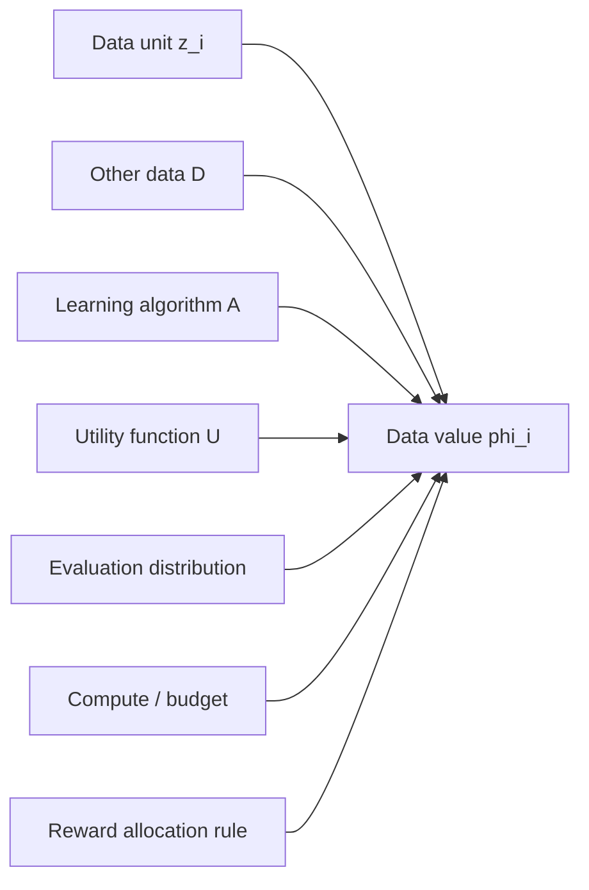
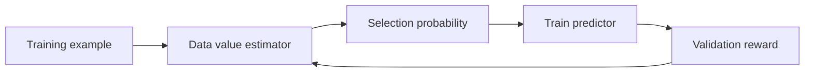
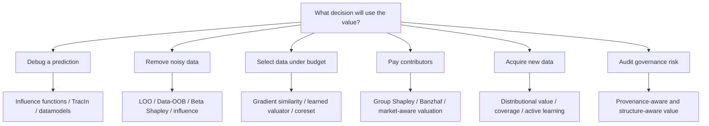

> Data value is not an intrinsic property of a data point. It is a counterfactual statement about how a data unit changes a learning system under a specific training algorithm, evaluation distribution, utility function, and social rule for attribution.

## Table of Contents

- [Why data value is hard to define](#why-data-value-is-hard-to-define)
- [A minimal setup](#a-minimal-setup)
- [What are we valuing?](#what-are-we-valuing)
- [Desiderata for data valuation](#desiderata-for-data-valuation)
- [Family 1: removal and marginal contribution](#family-1-removal-and-marginal-contribution)
- [Family 2: Shapley-style valuation](#family-2-shapley-style-valuation)
- [Family 3: semi-values, Banzhaf, and robust valuation](#family-3-semi-values-banzhaf-and-robust-valuation)
- [Family 4: gradient-based data attribution](#family-4-gradient-based-data-attribution)
- [Family 5: learned data valuators and datamodels](#family-5-learned-data-valuators-and-datamodels)
- [Family 6: distributional, group, and market-aware valuation](#family-6-distributional-group-and-market-aware-valuation)
- [Data value for foundation models](#data-value-for-foundation-models)
- [Practical recipe](#practical-recipe)
- [Failure modes](#failure-modes)
- [Open problems](#open-problems)
- [References](#references)

## Why data value is hard to define

Data is often treated as a generic resource: more data should make models better, larger datasets should be more valuable, and rare data should be more useful than repeated data. These statements are directionally plausible but technically incomplete. In machine learning, the worth of data is not determined by the data alone. It depends on the model, optimization procedure, downstream task, evaluation set, compute budget, data ownership structure, and the decision we want to make.

Consider four training examples:

1. a clean but redundant cat image in a dataset that already contains one million cat images;
2. a mislabeled medical image that consistently pushes the model toward a harmful diagnosis;
3. a rare but noisy example from a long-tail class;
4. a synthetic instruction that teaches a reasoning pattern not covered by the current fine-tuning set.

The first may have near-zero marginal value. The second may have negative value. The third may be valuable only when combined with nearby examples. The fourth may be high-value for a reasoning benchmark but irrelevant for a multilingual dialogue system. None of these values is absolute.

A more useful view is:

> The value of a data unit is the change it induces in a learning system under a specified utility.

This makes data valuation a counterfactual problem. We ask: *What would have happened if this data point, group, client, source, or distribution were absent, present, reweighted, delayed, or replaced?*

This question matters for at least five reasons.

- **Debugging.** Which training examples caused a wrong prediction? Which labels are suspicious?
- **Selection.** Which examples should be used when the training budget is limited?
- **Acquisition.** What kind of new data should be collected next?
- **Compensation.** How should reward be allocated among contributors in collaborative learning or data markets?
- **Governance.** Which data sources affect privacy, safety, bias, licensing, or the right to be forgotten?

These goals overlap but are not identical. A valuation rule that is good for debugging may be poor for compensation. A rule that is fair for data owners may be too slow for online selection. A rule that works for a small supervised classifier may not transfer to instruction tuning of a large language model.

## A minimal setup

Let a training dataset be

$$
D = \{z_i\}_{i=1}^n, \quad z_i = (x_i, y_i),
$$

where $x_i$ is an input and $y_i$ is a target. Let $A$ be a learning algorithm that maps any subset $S \subseteq D$ into a trained model:

$$
\theta_S = A(S).
$$

Let $U(S)$ be the utility of training on subset $S$, for example validation accuracy, negative loss, calibrated reward, robustness score, task-specific success rate, or a weighted combination of multiple metrics:

$$
U(S) = \mathrm{Perf}(A(S); D_{\mathrm{val}}).
$$

A data valuation method assigns each data unit $z_i$ a scalar value:

$$
\phi_i = \mathrm{Val}(z_i; D, A, U).
$$

The notation already shows the main difficulty: $\phi_i$ is not a property of $z_i$ alone. It is defined with respect to a dataset $D$, an algorithm $A$, and a utility $U$.

A useful mental model is the following dependency graph:



If any node changes, the value may change. The same example can be useful for one model, harmful for another, and irrelevant for a third. The same data source can be high-value early in pretraining but redundant later. The same client can be useful for personalization but detrimental for a global model.

This is why data valuation should be framed less as *measuring the intrinsic price of data* and more as *estimating the counterfactual role of data in a learning pipeline*.

## What are we valuing?

Before choosing a valuation method, it is necessary to specify the unit of valuation.

| Unit | Example | Typical question |
|---|---|---|
| Token | a wordpiece in a document | Which tokens contribute to factual recall or memorization? |
| Example | one image-label pair, one instruction-response pair | Which examples should be kept, removed, or relabeled? |
| Group | a class, domain, demographic group, data curator | Which group contributes most to utility or fairness? |
| Client | a hospital, user device, company, institution | How should federated rewards be allocated? |
| Dataset | an external corpus or benchmark | Which dataset should be licensed or acquired? |
| Distribution | a source population or environment | Which distribution improves deployment robustness? |
| Time slice | data collected at a specific period | How does data value decay or increase over time? |
| Synthetic generator | a model or data-generation pipeline | Which generator produces useful training signal? |

This distinction matters because data value is often **non-additive**. The value of a group is not necessarily the sum of the values of its members. Two examples can be individually weak but jointly useful. A dataset can be valuable because it covers a missing region of the input space, even if each example has modest point-wise value.

### A small example: redundancy and complementarity

Suppose a model already has many examples around a frequent pattern. Adding one more near-duplicate example may barely change validation performance:

$$
U(S \cup \{z_i\}) - U(S) \approx 0.
$$

But if $z_i$ is the only example near a decision boundary or a rare subpopulation, it may have a large marginal contribution. If $z_i$ is mislabeled, the marginal contribution may be negative:

$$
U(S \cup \{z_i\}) - U(S) < 0.
$$

Now consider two examples $z_i, z_j$ that are ambiguous alone but clarify a local pattern together:

$$
U(S \cup \{z_i\}) - U(S) \approx 0,
$$

$$
U(S \cup \{z_j\}) - U(S) \approx 0,
$$

but

$$
U(S \cup \{z_i, z_j\}) - U(S) \gg 0.
$$

Point-wise valuation struggles in this case unless it explicitly accounts for interactions. This is one reason Shapley-style methods became popular: they average marginal contributions across many possible coalitions.

## Desiderata for data valuation

Different applications need different desiderata. A compact list:

| Desideratum | Meaning | Why it matters |
|---|---|---|
| Faithfulness | Value should reflect actual impact on the target utility. | Necessary for selection and debugging. |
| Fairness | Contributors with comparable marginal roles should receive comparable reward. | Necessary for data markets and federated learning. |
| Stability | Rankings should not change wildly across random seeds or noisy utility estimates. | Necessary for reliable decisions. |
| Scalability | Method should work when $n$ is large and training is expensive. | Necessary for deep learning and foundation models. |
| Task-awareness | Value should depend on the downstream capability or evaluation distribution. | Necessary for targeted fine-tuning. |
| Group-awareness | Method should account for source, class, client, or temporal structure. | Necessary for governance and compensation. |
| Interaction-awareness | Method should capture complementarity and redundancy. | Necessary when examples work as coalitions. |
| Transferability | Values estimated on one model should remain useful for another model. | Useful for large-model data selection. |
| Privacy-awareness | Valuation should not leak sensitive information. | Necessary in regulated data pipelines. |

No single method satisfies all of them. The rest of the post is a taxonomy of major approaches and the trade-offs they make.

## Family 1: removal and marginal contribution

The simplest data value is leave-one-out (LOO): remove one point, retrain the model, and measure the utility drop.

$$
\phi_i^{\mathrm{LOO}} = U(D) - U(D \setminus \{z_i\}).
$$

If removing $z_i$ decreases performance, $z_i$ is helpful. If removing it increases performance, $z_i$ is harmful.

LOO is easy to explain and directly counterfactual. But it has three limitations.

First, it is expensive. Exact LOO requires retraining $n$ models. Second, it is local to the full dataset and ignores how the point behaves in smaller or different coalitions. Third, it underestimates data that is redundant with other useful examples. If two examples provide the same information, removing one may not hurt much, even though the pair as a whole is important.

A related value is the single-addition marginal contribution:

$$
\phi_i^{\mathrm{add}} = U(\{z_i\}) - U(\emptyset),
$$

but this is often uninformative for modern ML because one example alone rarely trains a useful model.

A more general marginal contribution is measured relative to a reference subset $S$:

$$
\Delta_i(S) = U(S \cup \{z_i\}) - U(S).
$$

This is the core primitive behind many valuation rules. The main question becomes: *which subsets $S$ should we average over, and with what weights?*

## Family 2: Shapley-style valuation

The Shapley value comes from cooperative game theory. In data valuation, the players are data units, the coalition is a subset of data, and the utility function is the performance of the model trained on that subset.

For $D = \{z_1, \dots, z_n\}$ and utility $U(\cdot)$, the Data Shapley value of $z_i$ is

$$
\phi_i^{\mathrm{Shapley}}
= \frac{1}{n}
\sum_{S \subseteq D \setminus \{z_i\}}
\frac{1}{\binom{n-1}{|S|}}
\Big[U(S \cup \{z_i\}) - U(S)\Big].
$$

Equivalently, sample a random permutation $\pi$ of all data points. Let $P_i^\pi$ be the set of points that appear before $z_i$ in the permutation. Then

$$
\phi_i^{\mathrm{Shapley}}
= \mathbb{E}_{\pi}
\left[ U(P_i^\pi \cup \{z_i\}) - U(P_i^\pi) \right].
$$

This interpretation is useful: Shapley value is the expected marginal contribution of a data point when data arrive in a random order.

### Why Shapley is attractive

The classic Shapley value is uniquely characterized by several axioms. In a data valuation context, they are commonly interpreted as follows.

- **Symmetry.** If two data points have the same marginal contribution to every coalition, they receive the same value.
- **Null player.** If a data point never changes utility, it receives zero value.
- **Additivity / linearity.** If utility is a sum of two utilities, the value under the sum is the sum of the values.
- **Efficiency.** The total value is distributed among all data points:

$$
\sum_i \phi_i = U(D) - U(\emptyset).
$$

These properties make Shapley appealing for compensation and collaborative data contribution. A contributor can argue that payment should reflect average marginal contribution across possible coalitions, not only behavior in the final dataset.

### Why Shapley is hard

The exact Shapley value requires considering all subsets, so the naive cost is exponential in $n$. For deep neural networks, each utility evaluation may require training or fine-tuning a model. This is usually infeasible.

Several approximations are common.

#### Monte Carlo Shapley

Sample random permutations and estimate the average marginal contribution:

```python
for permutation in random_permutations(D):
    S = empty_set
    old_u = U(S)
    for z_i in permutation:
        new_u = U(S union {z_i})
        value[z_i] += new_u - old_u
        S = S union {z_i}
        old_u = new_u
value /= num_permutations
```

This is conceptually simple but still expensive because it calls $U(S)$ many times.

#### Truncated Monte Carlo Shapley

In practice, the utility often saturates as the coalition grows. Once $U(S)$ is close enough to $U(D)$, later marginal contributions are small, so the permutation can be truncated. This reduces cost but introduces approximation error.

#### Model-specific shortcuts

For some model families, Shapley values can be computed more efficiently. A well-known example is KNN-Shapley, where the structure of nearest-neighbor prediction permits exact or much faster computation than generic retraining-based Shapley.

#### Group Shapley

Instead of valuing each point, we can value groups: data owners, classes, domains, clients, or sources. Group valuation reduces the number of players and better matches many real applications. It also avoids a common mismatch: institutions usually contribute datasets, not isolated examples.

### What Shapley captures well

Shapley-style valuation is useful when the central question is:

> How should the total utility of a collaborative learning system be attributed among data contributors?

It naturally accounts for redundancy and complementarity through averaging over coalitions. It can assign low value to redundant data and high value to data that improves many coalitions.

### What Shapley does not solve

Shapley is not a universal answer.

- It depends heavily on the utility function.
- It can be unstable when utility estimates are noisy.
- It assumes a particular fairness view; the symmetry axiom may be inappropriate when data has provenance, temporal dependence, augmentation structure, or source hierarchy.
- It is often too expensive for foundation model training.
- It gives a scalar summary, while real decisions may need richer explanations.

The important point is not that Shapley is always correct. The important point is that it formalizes data value as an average counterfactual contribution.

## Family 3: semi-values, Banzhaf, and robust valuation

Shapley is one member of a broader family of valuation rules called **semi-values**. A generic semi-value has the form

$$
\phi_i^{w}
= \sum_{S \subseteq D \setminus \{z_i\}} w_{|S|}
\Big[U(S \cup \{z_i\}) - U(S)\Big],
$$

where $w_{|S|}$ determines how much we care about coalitions of size $|S|$.

Different weights lead to different notions of value.

| Method | Informal behavior | Typical motivation |
|---|---|---|
| Leave-one-out | Focuses on the full dataset. | Simple debugging near the current model. |
| Shapley | Averages over all coalition sizes with Shapley weights. | Fair allocation of total utility. |
| Banzhaf | Samples coalitions with independent inclusion. | Robustness and simpler sampling. |
| Beta Shapley | Uses beta-distributed weights over coalition sizes. | Noise reduction and flexible emphasis on coalition regimes. |

### Banzhaf value

The Banzhaf value averages marginal contributions over coalitions where each other point is independently included with probability $1/2$:

$$
\phi_i^{\mathrm{Banzhaf}}
= \frac{1}{2^{n-1}}
\sum_{S \subseteq D \setminus \{z_i\}}
\Big[U(S \cup \{z_i\}) - U(S)\Big].
$$

Compared with Shapley, Banzhaf relaxes the efficiency requirement. This can be a feature rather than a bug. In noisy ML settings, forcing all value to sum exactly to $U(D)-U(\emptyset)$ may amplify noise. Banzhaf-style methods can be more robust to stochastic training and noisy performance estimates.

### Beta Shapley

Beta Shapley generalizes the weighting over coalition sizes using a beta distribution. Intuitively, it lets us choose whether to emphasize small, medium, or large coalitions.

This is useful because different applications care about different regimes:

- data acquisition may care about small-to-medium coalitions;
- removal auditing may care about near-full coalitions;
- compensation may care about all coalitions more evenly;
- noisy label detection may benefit from weights that reduce variance.

### Data-OOB

For bagging models, out-of-bag estimates offer a computationally efficient way to estimate data value. The key idea is to reuse weak learners that were trained without a given data point and compare their behavior with learners that included it. This avoids repeated full retraining and can scale to large datasets in settings where bagging is natural.

The broader lesson from semi-values is that valuation is not only about estimating a fixed formula more efficiently. It is also about choosing the right axioms and weights for the downstream decision.

## Family 4: gradient-based data attribution

Shapley-style methods ask how utility changes when data enters or leaves the training set. Gradient-based methods ask a more local question:

> How did a training point influence a model parameter update, and how did that update affect a target prediction?

This is especially useful for debugging individual predictions.

### Influence functions

Influence functions approximate how the learned parameters would change if we upweighted a training point $z_i$ by a small amount. Let

$$
\hat{\theta} = \arg\min_\theta \frac{1}{n}\sum_{j=1}^n \ell(z_j, \theta).
$$

If $z_i$ is upweighted by $\epsilon$, the parameter change can be approximated by

$$
\frac{d \hat{\theta}_{\epsilon, i}}{d\epsilon}\bigg|_{\epsilon=0}
= - H_{\hat{\theta}}^{-1} \nabla_\theta \ell(z_i, \hat{\theta}),
$$

where

$$
H_{\hat{\theta}} = \frac{1}{n}\sum_{j=1}^n \nabla_\theta^2 \ell(z_j, \hat{\theta})
$$

is the Hessian of the empirical risk.

The influence of $z_i$ on the loss at a test point $z_{\mathrm{test}}$ is approximately

$$
I(z_i, z_{\mathrm{test}})
= - \nabla_\theta \ell(z_{\mathrm{test}}, \hat{\theta})^\top
H_{\hat{\theta}}^{-1}
\nabla_\theta \ell(z_i, \hat{\theta}).
$$

If $I(z_i, z_{\mathrm{test}})$ is negative, upweighting $z_i$ reduces the test loss, so $z_i$ is helpful for that test point. If it is positive, $z_i$ is harmful.

Influence functions are elegant because they connect prediction behavior to training data without retraining the model. The practical challenge is that modern neural networks are non-convex, high-dimensional, and expensive to invert through the Hessian.

### TracIn

TracIn avoids explicit Hessian inversion by tracing the training process. The idea is that a training example influences a test example whenever a gradient step on the training example changes the test loss.

A simplified TracIn score is

$$
\mathrm{TracIn}(z_i, z_{\mathrm{test}})
= \sum_{t \in \mathcal{C}} \eta_t
\nabla_\theta \ell(z_i, \theta_t)^\top
\nabla_\theta \ell(z_{\mathrm{test}}, \theta_t),
$$

where $\mathcal{C}$ is a set of saved checkpoints and $\eta_t$ is the learning rate. If gradients align, training on $z_i$ tends to reduce the loss on $z_{\mathrm{test}}$; if gradients conflict, it may increase the loss.

This gradient-similarity view is now widely used in data selection for large models. Instead of evaluating every candidate by retraining, we represent examples by gradient features and retrieve those most aligned with target tasks.

### Influence for targeted instruction tuning

For instruction tuning, the question is often not “which data improves average validation accuracy?” but rather:

> Which examples teach a target capability, such as mathematical reasoning, code generation, tool use, or safety refusal?

A capability-conditioned value can be written as

$$
\phi_i^{\mathrm{target}}
= \mathrm{sim}\left(g_i, g_{\mathrm{target}}\right),
$$

where $g_i$ is a gradient representation of candidate instruction $i$ and $g_{\mathrm{target}}$ is a gradient representation of a few examples or tasks that define the desired capability.

This is different from generic data quality. A high-quality translation instruction may have low value for improving math reasoning. A messy but structurally useful reasoning example may be high-value for a reasoning-specific target.

### Local vs global data value

Gradient-based attribution is often **local**:

- local to a trained model,
- local to a test point or target capability,
- local to the optimization trajectory,
- local to a representation of gradients.

This locality is a strength for debugging and targeted selection. It is a weakness for fair compensation or broad market pricing, where the desired value notion is usually more global.

## Family 5: learned data valuators and datamodels

Another route is to learn the valuation function itself.

### DVRL: learning a data value estimator

Data Valuation using Reinforcement Learning (DVRL) trains a data value estimator that decides how likely each training example should be selected. A predictor is trained on selected data, and the data value estimator receives a reward based on validation performance.

The simplified loop is:



This turns data valuation into a meta-learning problem. The value estimator does not need to satisfy Shapley axioms; it only needs to learn a selection policy that improves the target task.

The advantage is adaptivity. The limitation is that the learned values are tied to the meta-training setup, validation reward, model class, and selection policy. They may not be easy to interpret as fair payments.

### Datamodels: predicting predictions from training subsets

Datamodeling takes a different view. For a fixed test example $x$, define a function that maps a training subset $S' \subseteq D$ to the model output on $x$ after training on $S'$:

$$
f_x(S') = \mathrm{output}(A(S'), x).
$$

A linear datamodel approximates this subset-to-prediction map as

$$
f_x(S') \approx \beta_x^\top \mathbf{1}_{S'},
$$

where $\mathbf{1}_{S'} \in \{0,1\}^n$ indicates which training examples are included in $S'$, and $\beta_x$ assigns a coefficient to each training example for the target prediction $x$.

This is conceptually powerful. Instead of asking for a single global value, datamodels ask: *which training examples control this prediction?* If the approximation works, one can estimate dataset counterfactuals, identify brittle predictions, detect train-test leakage, and embed training examples by their prediction-level effects.

The cost is high: fitting datamodels may require training many models on many random subsets. But as a scientific lens, datamodeling makes explicit something that is often hidden: model behavior is a function of the training set.

### Learned value vs axiomatic value

Axiomatic valuation starts from principles such as fairness, symmetry, and efficiency. Learned valuation starts from predictive usefulness. They answer different questions.

| Question | Better matched family |
|---|---|
| How should contributors be compensated? | Shapley / Banzhaf / group valuation |
| Which examples should I keep for training? | Learned valuator / influence / selection score |
| Which examples caused this prediction? | Influence / TracIn / datamodels |
| Which data source should I acquire next? | Distributional / acquisition-aware valuation |
| Which clients helped the global model? | Federated group valuation |

A common mistake is to use one type of value for all decisions. A score optimized for selection is not automatically a fair payment rule. A fair payment rule is not automatically the most efficient pruning criterion.

## Family 6: distributional, group, and market-aware valuation

Point-wise valuation is only one layer. In many applications, data comes from distributions, institutions, users, and pipelines.

### Distributional value

Data Shapley assigns values to points in a fixed dataset. But in many settings, the real object of interest is a distribution. A hospital, user group, or data vendor does not only contribute a finite list of examples; it represents a sampling process.

Distributional valuation asks how useful a point or source is with respect to an underlying data distribution. This can make values more stable and better suited for acquisition. Instead of asking whether a single rare example is valuable, we ask whether more data from its region would improve the learner.

### Group value

Group valuation is necessary when the unit of ownership is not a single point. Examples:

- a hospital contributes a cohort of medical images;
- a mobile device contributes local user interactions;
- a data vendor contributes an entire corpus;
- a synthetic data generator contributes a batch of generated instructions;
- a company contributes proprietary logs.

If we value only individual examples and sum them, we may miss group-level interaction. A source can be valuable because it has coverage, diversity, or complementarity with other sources.

For groups $G_1, \dots, G_m$, a group utility is

$$
U(T) = \mathrm{Perf}\left(A\left(\bigcup_{j \in T} G_j\right); D_{\mathrm{val}}\right),
$$

where $T \subseteq \{1, \dots, m\}$. Then the players are groups rather than examples.

### Asymmetric and structure-aware value

Classic Shapley assumes symmetry: if two players make identical marginal contributions, they should receive the same value. But modern data pipelines often have structure.

Examples:

- augmented examples depend on original examples;
- synthetic data depends on a generator and prompt distribution;
- later instruction-tuning data depends on the pretrained model;
- federated updates arrive in time;
- data sources have ownership hierarchy;
- some data are derived from copyrighted or licensed corpora.

In such cases, symmetry may erase important dependencies. A structure-aware valuation rule may need to respect temporal order, provenance, or dependency graphs.

A simple example is original-versus-augmentation. If $z_j$ is an augmentation of $z_i$, equal marginal effects should not necessarily imply equal economic reward. The augmented point may exist only because the original point exists. This suggests a need for data valuation over graphs, not only sets.

### Data markets and incentives

In a data market, valuation is not just an ML problem. It becomes a mechanism design problem.

A useful valuation rule should discourage undesirable behavior:

- uploading duplicates to inflate payment;
- splitting one dataset into many identities;
- hiding provenance;
- poisoning the validation set;
- contributing low-quality synthetic data that exploits the scoring rule;
- colluding with other data providers;
- optimizing for benchmark leakage rather than general utility.

This connects data valuation to governance. Once a value score determines payment, reputation, or data access, contributors may optimize against it. The valuation rule itself becomes part of the system being optimized.

## Data value for foundation models

Foundation models change the scale and semantics of data valuation.

In classical supervised learning, a data point usually means one labeled example and the utility is often validation accuracy. In foundation models, the unit and utility are more ambiguous.

| Stage | Data unit | Utility |
|---|---|---|
| Pretraining | token, document, website, image-text pair, video clip | broad next-token or representation quality |
| Instruction tuning | instruction-response pair, conversation, preference trace | target capability, helpfulness, safety, format following |
| RLHF / preference optimization | pairwise preference, reward label, rubric | preference alignment, reward model calibration |
| Retrieval-augmented generation | document chunk, memory item, tool result | factuality, answer accuracy, citation quality |
| Continual adaptation | new task stream, domain batch, user feedback | retention, plasticity, forward transfer |
| Multimodal learning | image-text pair, video-caption pair, region-text annotation | alignment, grounding, temporal consistency |

### Data value is capability-conditioned

For a general instruction dataset $D$ and a target capability $c$, the value of example $z_i$ should be written as

$$
\phi_i(c) = \mathrm{Val}(z_i; D, A, U_c),
$$

where $U_c$ measures performance on capability $c$.

This matters because one dataset may contain many latent skills. An instruction about planning may help agentic tool use. A chain-of-thought example may help math but hurt concise response style. A refusal example may improve safety but reduce compliance on benign edge cases if over-sampled.

Generic quality scores are insufficient. A polished response is not necessarily high-value. A noisy example can be valuable if it teaches a missing skill. A beautiful image-text pair can be low-value if it is redundant with existing alignment data.

### Data value is stage-dependent

The same data can have different values across the model lifecycle.

- In early pretraining, broad coverage is valuable.
- In late pretraining, rare high-quality domains may matter more.
- In instruction tuning, format and task diversity become important.
- In preference learning, label consistency and preference separability matter.
- In continual learning, examples that protect old skills may be valuable even if they do not improve the new task.

This suggests a time-indexed value:

$$
\phi_i^{(t)} = \mathrm{Val}(z_i; D_t, A_t, U_t),
$$

where $t$ indexes the training stage.

### Data value is interaction-heavy

Foundation models learn from mixtures. A data source can be valuable not because it is individually strong, but because it balances another source.

Examples:

- code data may improve reasoning but distort natural language style if overrepresented;
- synthetic math data may help step-by-step reasoning but reduce diversity;
- safety data may improve refusal calibration but create over-refusal when mixed poorly;
- multilingual data may improve cross-lingual transfer but compete for capacity;
- multimodal grounding data may improve visual reasoning only when paired with enough language instruction data.

The unit of value is often not a point but a mixture coefficient.

Let training minimize a mixture objective:

$$
\mathcal{L}(\theta; \alpha)
= \sum_{k=1}^K \alpha_k \mathbb{E}_{z \sim P_k}[\ell(z, \theta)],
$$

where $P_k$ are data sources and $\alpha_k$ are mixture weights. The value of a source is related to the derivative of downstream utility with respect to its mixture weight:

$$
\frac{\partial U}{\partial \alpha_k}.
$$

This moves us from point-wise valuation to data-mixture optimization.

### Multimodal data value

For multimodal models, data quality is not only about label correctness. It also includes alignment:

- Does the text describe the image accurately?
- Are regions grounded to the right entities?
- Does the video caption capture temporal order?
- Are visual attributes distinguishable?
- Does the annotation include compositional relations?
- Is the pair informative or merely generic?

A caption like “a dog in a park” may be correct but low-value if the image contains richer relations. A region-level annotation may be more valuable than a whole-image caption for grounding. A temporally precise video description may be more valuable than a generic summary for video-language learning.

A useful multimodal value may need to combine:

$$
\phi_i = \lambda_1 \phi_i^{\mathrm{semantic}}
+ \lambda_2 \phi_i^{\mathrm{alignment}}
+ \lambda_3 \phi_i^{\mathrm{grounding}}
+ \lambda_4 \phi_i^{\mathrm{diversity}}
+ \lambda_5 \phi_i^{\mathrm{downstream}}.
$$

The hard part is not writing this equation. The hard part is making the components measurable, robust, and predictive of training outcomes.

## Practical recipe

A practical data valuation workflow starts from the decision to be made.



### Step 1: choose the utility

The most important design choice is the utility function.

Bad utility:

$$
U(S) = \text{accuracy on a convenient but mismatched validation set}.
$$

Better utility:

$$
U(S) = \sum_{k=1}^K \omega_k \mathrm{Perf}_k(A(S)) - \lambda \mathrm{Risk}(A(S)),
$$

where $\mathrm{Perf}_k$ are task-specific metrics and $\mathrm{Risk}$ may include calibration error, unsafe behavior, bias, privacy leakage, or memorization.

The utility defines the value. If the utility ignores safety, unsafe data can look valuable. If the utility overweights a benchmark, benchmark-specific data can dominate. If the utility ignores minority groups, data from those groups may be undervalued.

### Step 2: choose the valuation unit

If the goal is relabeling, use point-level value. If the goal is payment, use contributor-level or group-level value. If the goal is data acquisition, use distribution-level value. If the goal is pretraining mixture design, use source-level or mixture-level value.

### Step 3: choose the computational approximation

A rough guide:

| Scale | Reasonable methods |
|---|---|
| Small tabular / classical ML | LOO, Shapley, KNN-Shapley, Data-OOB |
| Medium deep learning | TMC-Shapley, influence, TracIn, learned valuators |
| Large LLM fine-tuning | gradient similarity, low-rank gradient features, targeted selection |
| Federated / institutional data | group Shapley, Banzhaf, client-level contribution, update attribution |
| Data market | group valuation + mechanism design + provenance constraints |

### Step 4: validate values by interventions

A value score is only useful if it predicts interventions. Common checks:

1. Remove low-value data and retrain. Does performance improve or stay stable?
2. Remove high-value data. Does performance drop?
3. Relabel low-value suspicious data. Does value increase?
4. Acquire more data similar to high-value data. Does performance improve?
5. Recompute values across seeds. Are rankings stable?
6. Change the validation distribution. Which values change?
7. Compare across models. Are values transferable?

A valuation method should not only produce plausible rankings. It should survive counterfactual tests.

### Step 5: monitor selection feedback loops

Once data values are used for selection, the training distribution changes. The value scores should be recomputed or updated.

A one-shot selection rule can create failure modes:

- it removes hard but necessary data;
- it over-selects easy examples;
- it amplifies duplicates;
- it narrows the distribution;
- it overfits to the validation set;
- it undervalues future-useful data.

Data valuation is therefore often an iterative control problem, not a static scoring problem.

## Failure modes

### 1. Valuing data against the wrong objective

If the validation set is wrong, the value score is wrong. A data point that improves a narrow benchmark may hurt deployment. A source that improves average accuracy may worsen calibration or fairness.

The utility function is the constitution of the valuation system. Every omitted objective becomes a blind spot.

### 2. Treating data value as intrinsic

A value score estimated for one model, task, or training stage may not transfer. A sample can be high-value for a small model because it teaches a simple pattern but low-value for a large model that already knows the pattern. A sample can be high-value for robustness but low-value for in-domain accuracy.

The safer statement is:

$$
\phi_i \text{ is valid under } (D, A, U, D_{\mathrm{eval}}, \text{budget}).
$$

### 3. Ignoring interactions

Point-wise values can miss complementarity. This is common in long-tail learning, multimodal grounding, and compositional tasks. A single rare example may look unimportant, while a cluster of rare examples is essential.

This suggests using group valuation, class-conditioned valuation, or diversity-aware selection rather than pure point ranking.

### 4. Rewarding duplicates

If the valuation rule does not penalize redundancy, contributors can upload near-duplicates. Shapley-style averaging handles redundancy better than simple count-based payment, but duplicates can still create complications when the utility estimator is noisy or the grouping rule is poorly specified.

### 5. Utility noise and unstable ranking

Deep learning training is stochastic. Validation metrics are noisy. Small differences in utility can cause large changes in rankings. This is especially problematic when value scores determine payment or deletion.

Robustness should be measured explicitly:

- rank correlation across seeds;
- confidence intervals for values;
- sensitivity to validation subsets;
- stability under small perturbations;
- agreement across valuation methods.

### 6. Negative value is not always bad data

A data point can have negative value for several reasons:

- it is mislabeled;
- it is out-of-distribution;
- it conflicts with the current objective;
- it represents a minority distribution ignored by the utility;
- it is useful for robustness but harmful for average accuracy;
- it is correct but too hard for the current model.

Therefore, negative value should trigger diagnosis, not automatic deletion.

### 7. Strategic manipulation

In markets or federated systems, contributors may react to the valuation rule. If payment rewards marginal accuracy, providers may optimize for benchmark leakage. If payment rewards uniqueness, providers may create artificial diversity. If payment rewards volume, providers may add duplicates.

A valuation mechanism should be paired with provenance checks, anti-duplication rules, robust validation, and audit trails.

### 8. Privacy leakage

Data attribution can reveal which training examples influenced which predictions. This is useful for transparency but risky for privacy. A high influence score may expose membership, sensitive content, or proprietary data.

Privacy-aware data valuation remains underdeveloped. It may require differential privacy, aggregation, secure computation, or restricted disclosure.

## Open problems

### 1. Data valuation for trillion-token pretraining

Most principled valuation methods are far too expensive for pretraining-scale corpora. We need estimators that work with streaming data, partial training runs, proxy models, and cheap signals while still predicting final utility.

A promising direction is multi-fidelity valuation:

$$
\phi_i^{\mathrm{large}} \approx f(\phi_i^{\mathrm{small}}, \phi_i^{\mathrm{proxy}}, \phi_i^{\mathrm{gradient}}, \phi_i^{\mathrm{metadata}}).
$$

The challenge is calibration. Proxy values can be systematically biased.

### 2. Capability-conditioned value

For foundation models, data value should be indexed by capability:

$$
\phi_i(c_1), \phi_i(c_2), \dots, \phi_i(c_K).
$$

An example can be valuable for reasoning, neutral for factuality, and harmful for safety. Scalar value may be too compressed. A vector-valued data value may better match model behavior.

### 3. Multimodal and temporal data value

For images, videos, robotics trajectories, and medical data, value depends on structure:

- spatial grounding;
- temporal consistency;
- modality alignment;
- action causality;
- anatomical or physical constraints;
- rare event coverage.

Existing point-wise text-centric valuation methods do not directly capture these dimensions.

### 4. Coalition and hierarchy-aware valuation

Data is rarely independent. It has ownership hierarchy, provenance graphs, augmentation relations, synthetic generation chains, and temporal dependencies. A future valuation framework should operate over structured objects:

$$
\mathcal{G} = (V, E),
$$

where nodes are data units or sources and edges encode derivation, ownership, similarity, or temporal precedence.

### 5. Causal data value

Most data valuation is associational: it measures changes in utility under inclusion or exclusion. But inclusion is not always a clean causal intervention. Data collection policies, labeling processes, and source distributions introduce confounding.

A causal notion of data value would ask:

> What is the effect of intervening on the data-generation process, not merely adding or removing observed samples?

This is particularly important for data acquisition and policy decisions.

### 6. Valuation under continual learning

In continual learning, data value is dynamic. A replay example may be valuable because it prevents forgetting, not because it improves the current task. A new example may be valuable because it opens future transfer, not because it immediately improves validation accuracy.

A continual value might decompose into:

$$
\phi_i^{\mathrm{continual}}
= \phi_i^{\mathrm{plasticity}}
+ \phi_i^{\mathrm{stability}}
+ \phi_i^{\mathrm{transfer}}
- \phi_i^{\mathrm{interference}}.
$$

This is especially relevant for vision-language models, agents, and personalization systems.

### 7. Incentive-compatible data markets

If data value determines payment, the valuation rule becomes a target for manipulation. A complete data market needs:

- valuation;
- provenance;
- privacy;
- anti-collusion;
- duplicate detection;
- legal constraints;
- dynamic pricing;
- contributor reputation;
- auditability.

This is more than an ML scoring problem. It is a socio-technical system.

### 8. Benchmarks that evaluate values, not only models

A valuation benchmark should test whether values lead to good decisions:

- Can low-value points reveal label noise?
- Can high-value points improve data acquisition?
- Can values transfer across models?
- Can values remain stable across seeds?
- Can values detect harmful data?
- Can values support fair group compensation?

The output of a valuation method is not a prediction. It is a decision-support signal. The benchmark should reflect that.

## Takeaways

1. Data value is **context-dependent**. It depends on the dataset, model, algorithm, utility, evaluation distribution, and decision rule.
2. Data value is **counterfactual**. It asks what changes when data is added, removed, reweighted, or replaced.
3. Data value is often **non-additive**. Interactions, redundancy, and complementarity matter.
4. Shapley-style methods provide a principled fairness lens but can be expensive and may rely on axioms that do not fit every ML pipeline.
5. Influence-based methods are useful for local debugging and targeted selection but are not automatically fair payment rules.
6. Learned valuators and datamodels can capture practical utility but depend heavily on meta-training and subset sampling.
7. Foundation models require capability-conditioned, stage-dependent, multimodal, and mixture-level notions of value.
8. Data markets require more than value estimation: they need incentive-compatible mechanisms and governance.

A concise final definition:

> A data value is a decision-dependent estimate of how a data unit, group, source, or distribution changes the behavior, utility, risk, or economic payoff of a learning system under counterfactual intervention.

## References

- Ghorbani, A. and Zou, J. (2019). [Data Shapley: Equitable Valuation of Data for Machine Learning](https://proceedings.mlr.press/v97/ghorbani19c.html). ICML.
- Koh, P. W. and Liang, P. (2017). [Understanding Black-box Predictions via Influence Functions](https://proceedings.mlr.press/v70/koh17a.html). ICML.
- Jia, R., Dao, D., Wang, B., et al. (2019). [Efficient Task-Specific Data Valuation for Nearest Neighbor Algorithms](https://arxiv.org/abs/1908.08619). PVLDB.
- Yoon, J., Arik, S. O., and Pfister, T. (2020). [Data Valuation using Reinforcement Learning](https://proceedings.mlr.press/v119/yoon20a.html). ICML.
- Ghorbani, A., Kim, M. P., and Zou, J. (2020). [A Distributional Framework for Data Valuation](https://arxiv.org/abs/2002.12334). ICML.
- Pruthi, G., Liu, F., Kale, S., and Sundararajan, M. (2020). [Estimating Training Data Influence by Tracing Gradient Descent](https://arxiv.org/abs/2002.08484). NeurIPS.
- Kwon, Y. and Zou, J. (2022). [Beta Shapley: A Unified and Noise-reduced Data Valuation Framework for Machine Learning](https://proceedings.mlr.press/v151/kwon22a.html). AISTATS.
- Sim, R. H. L., Xu, X., and Low, B. K. H. (2022). [Data Valuation in Machine Learning: “Ingredients”, Strategies, and Open Challenges](https://www.ijcai.org/proceedings/2022/782). IJCAI Survey Track.
- Ilyas, A., Park, S. M., Engstrom, L., Leclerc, G., and Madry, A. (2022). [Datamodels: Predicting Predictions from Training Data](https://arxiv.org/abs/2202.00622). ICML.
- Wang, J. T. and Jia, R. (2023). [Data Banzhaf: A Robust Data Valuation Framework for Machine Learning](https://arxiv.org/abs/2205.15466). AISTATS.
- Kwon, Y. and Zou, J. (2023). [Data-OOB: Out-of-bag Estimate as a Simple and Efficient Data Value](https://arxiv.org/abs/2304.07718). ICML.
- Jiang, K. F., Liang, W., Zou, J., and Kwon, Y. (2023). [OpenDataVal: a Unified Benchmark for Data Valuation](https://arxiv.org/abs/2306.10577). NeurIPS Datasets and Benchmarks.
- Xia, M., Malladi, S., Gururangan, S., Arora, S., and Chen, D. (2024). [LESS: Selecting Influential Data for Targeted Instruction Tuning](https://arxiv.org/abs/2402.04333). ICML.
- Liu, Z., Zhou, K., Zhao, W. X., Gao, D., Li, Y., and Wen, J.-R. (2024). [Less is More: High-value Data Selection for Visual Instruction Tuning](https://arxiv.org/abs/2403.09559). arXiv.
- Xie, T., Li, H., Bai, A., and Hsieh, C.-J. (2024). [Data Attribution for Diffusion Models: Timestep-induced Bias in Influence Estimation](https://arxiv.org/abs/2401.09031). arXiv.
- pyDVL contributors. [pyDVL: Python Data Valuation Library](https://pydvl.org/stable/).
- OpenDataVal contributors. [OpenDataVal benchmark and toolkit](https://opendataval.github.io/).

